# Orchestrate — agent pattern selection

A Claude Code skill that reads a task, picks the **cheapest orchestration
pattern that fits** (P0–P7), and runs only the roles and resources actually
needed. The coordinator is the main session; specialized subagents do the work
in isolated context windows and return only their findings.

Skill definition: [SKILL.md](SKILL.md) · Role definitions: [../../agents/README.md](../../agents/README.md)

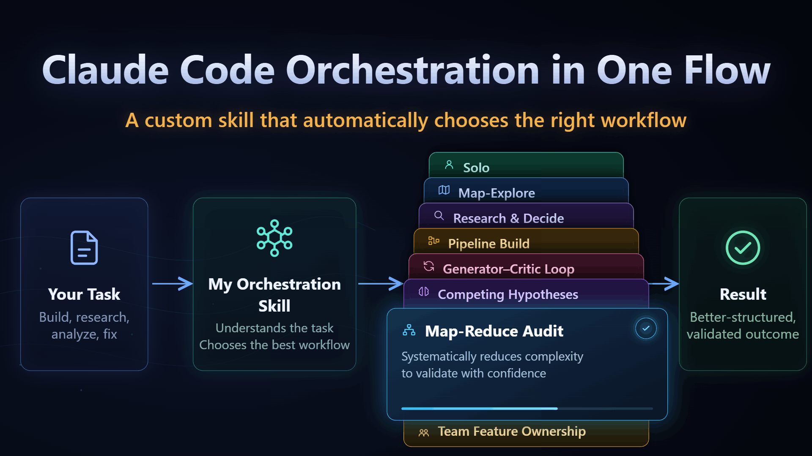

> **Diagram reflects skill v1.0.** Predates P8, the cost arithmetic, and the
> result-collection rule. See the revision history in [SKILL.md](SKILL.md).

## How it manages context

The main session stays clean. A single `brief.md` (task, constraints, file
pointers) is written once and read by every agent. Each agent works in its own
context window, so dead ends and intermediate reasoning die there — only
curated findings return to the main session.

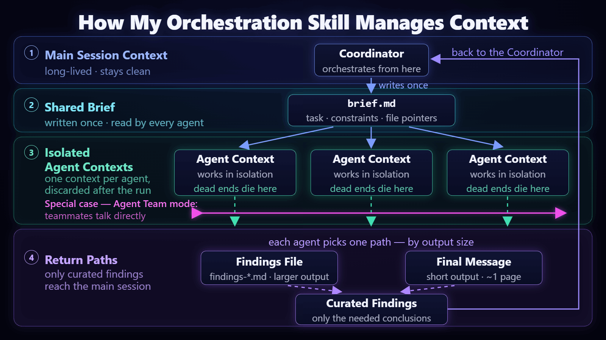

> **Diagram reflects skill v1.0.** Shows each agent writing its own findings file;
> since v2.0 the read-only roles return findings in their final message and the
> coordinator persists them.

## How it picks model and effort

Cheap settings for supporting work; stronger models and higher effort only
where depth matters (analysis, architecture, criticism, verification). If a
result is weak, the same role is rerun at a higher tier — not padded with new
agents.

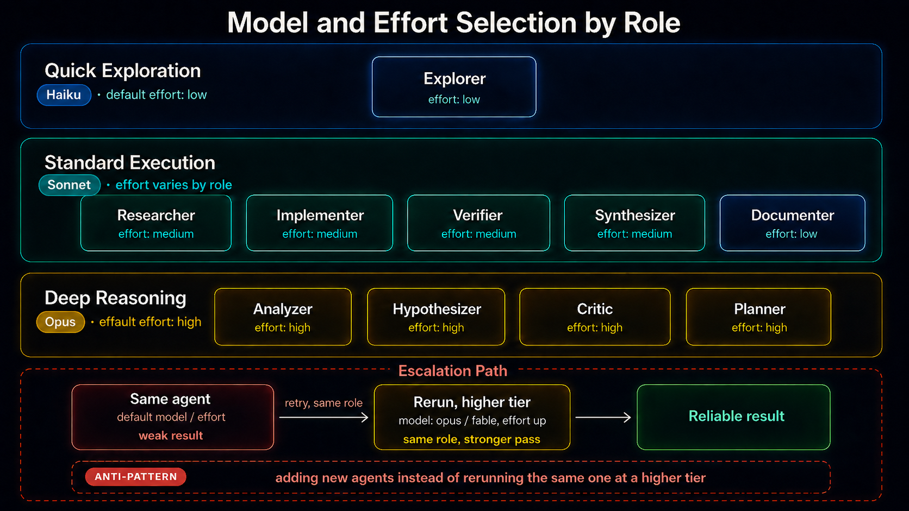

> **Diagram reflects skill v1.0.** Effort cannot be set when spawning an agent —
> it comes from the role file. Since v2.1 only `model` is a spawn-time lever.

## The patterns

### P0 · Solo
No subagents. Fits in context, ≤ ~3 files, iterative with the user. The default.

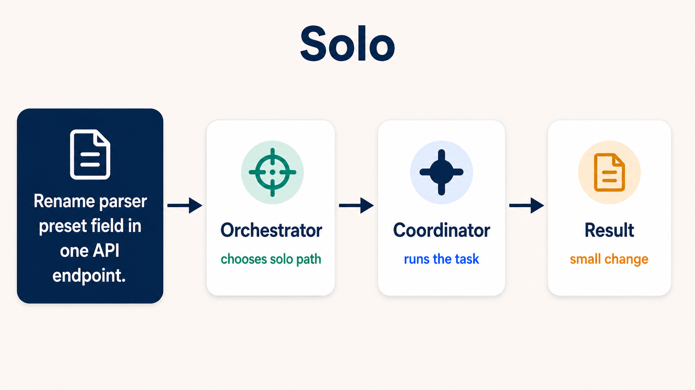

### P1 · Map-Explore (fan-out recon)
Parallel explorers map different areas; the coordinator synthesizes. Use when
scope is unknown or spread across several repo areas.

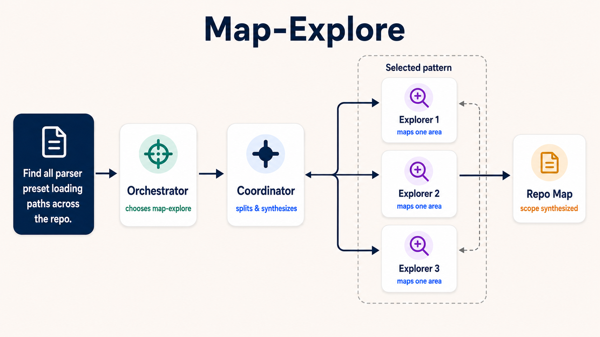

### P2 · Research & Decide
Researchers explore options in parallel, an analyzer checks repo fit, and the
coordinator compares. Use for tech choices and lock-in decisions needing evidence.

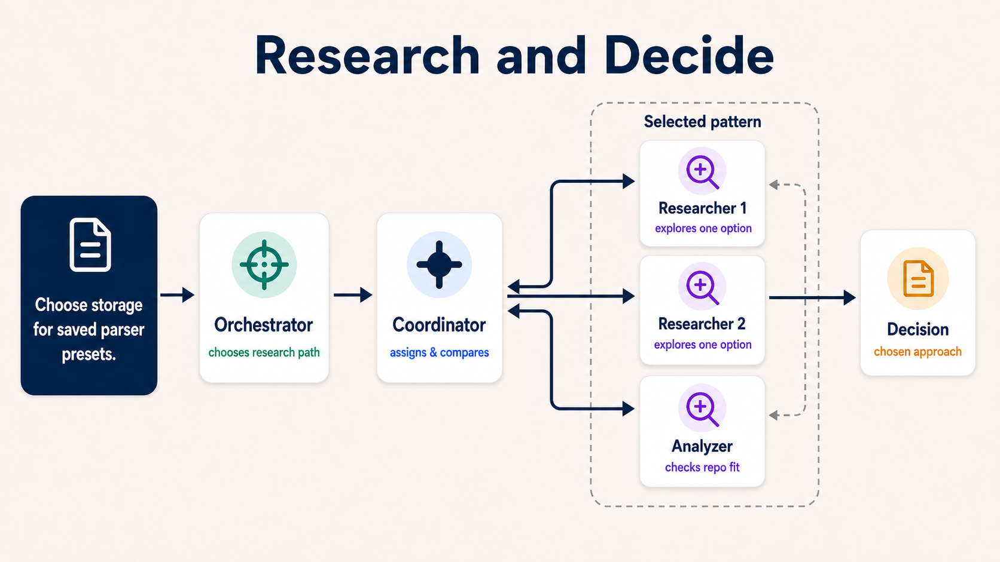

### P3 · Pipeline Build
planner → implementer → verifier → critic. Use for a multi-file feature with a
clear spec.

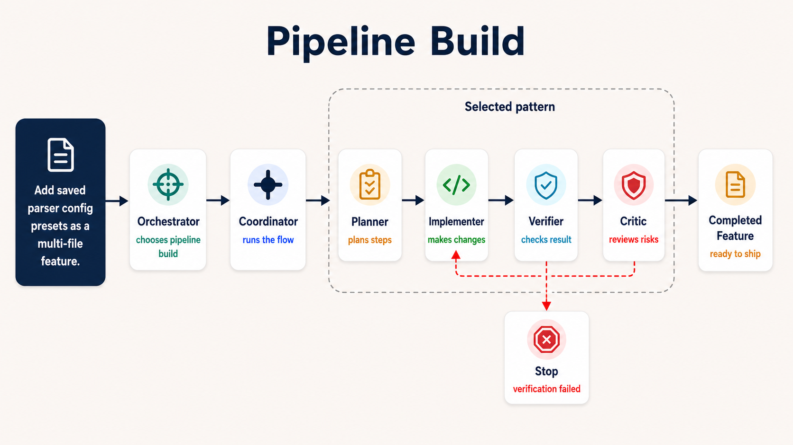

### P4 · Generator–Critic Loop
implementer ⇄ critic (≤3 rounds) → verifier. Use for correctness-critical
changes with high blast radius.

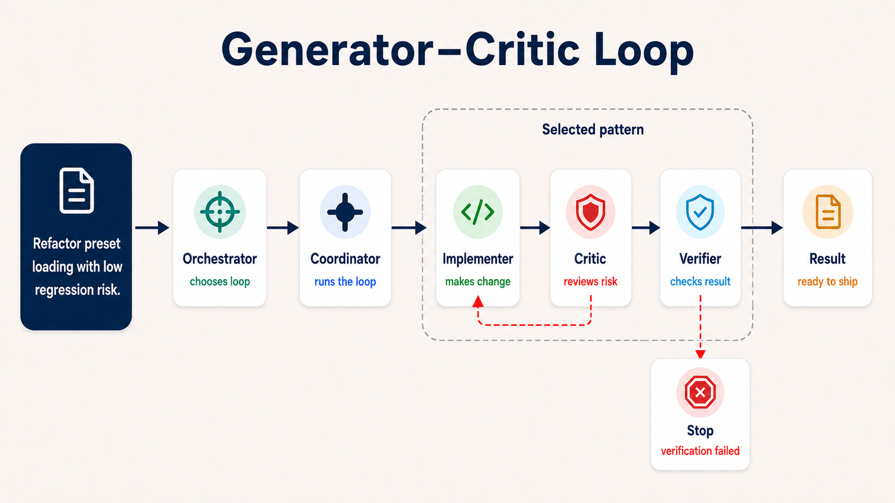

### P5 · Competing Hypotheses
A hypothesizer proposes theories, analyzers test them in parallel, a critic
ranks. Use for hard bugs with conflicting evidence or failed prior fixes.

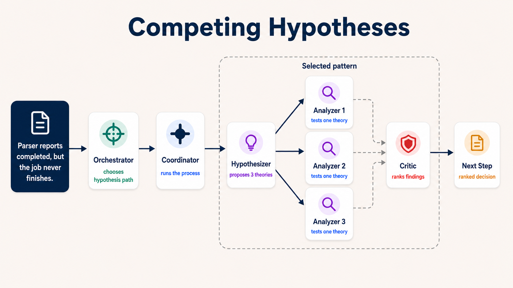

### P6 · Map-Reduce Audit
The coordinator partitions the corpus across parallel analyzers; a synthesizer
merges findings. Use for large-corpus reviews, audits, or migration sweeps.

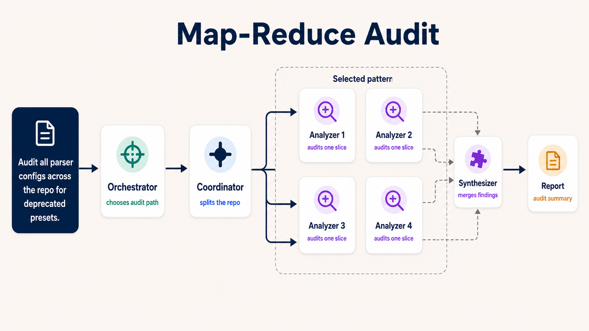

### P7 · Team Feature Ownership
A lead plus teammates own layers (API, UI, tests) and message each other
directly. Use for independent workstreams that need teammate↔teammate coordination.

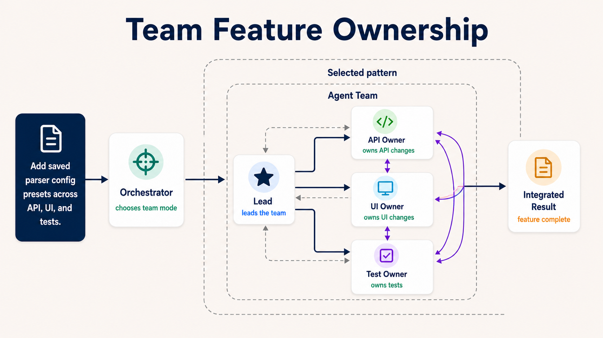
